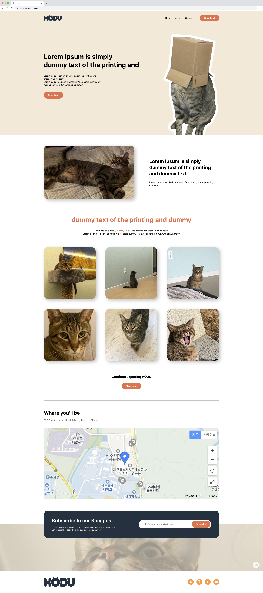

# hodu-site-front-end-project

>HODU 사이트를 만드는 프론트엔드 프로젝트입니다.

## 참고 이미지
  

*피그마 사이트:*
<https://www.figma.com/file/s9RCnA6dSi3QHHeMDFHKE6/EST-%EB%B0%B1%EC%97%94%EB%93%9C-4%EA%B8%B0_HTML%2FCSS%2FJS?type=design&node-id=104924-12&mode=design&t=T7DNEtR7A89eYenD-0>  

### 카카오맵 api키 숨기기
>`.gitignore` 파일에 명시해준다.  

### aside 버튼 추가
`window.scrollTo({left:0, top:0, behavior:'smooth'});`  
이와 같은 코드로 특정 위치로 이동 가능하다.  
`element.classList.add("on");  `  
`element.classList.remove("on");`  
이와 같은 코드로 elment의 클래스 변경이 가능하다.

